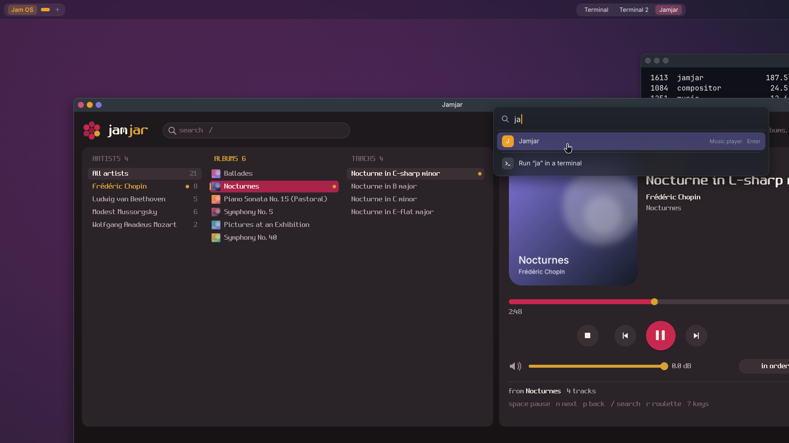

<h1 align="center">
  <picture>
    <source media="(prefers-color-scheme: dark)" srcset="docs/logo/jamos-lockup-dark.png">
    
  </picture>
</h1>

Jam OS is a from-scratch operating system for x86_64 PCs, written in C.
It is capability-based: a program can do only what the handles it holds
allow, and every driver and service runs as a separate user process that
the kernel supervises through those handles, so a crashed driver doesn't
take the system down. The IOMMU, on by default since the real PC signed
it off (2026-10-07), also keeps a faulty driver's device from reaching
memory its driver didn't pin (`iommu=off`, or the boot menu's "Developer >
Jam OS (no IOMMU)", turns it off). It boots from a USB stick on a real
desktop PC, which is where every milestone is tested, into a desktop of
its own.

## A tour


The desktop, tiled: each new window splits the one in focus, here two
terminals and Jamjar, the music player, playing from a USB stick.



The search box: tap Super (or click "Jam OS" on the top bar) to start an
app or run a command in a new terminal.


The same windows floating (Super+T switches a screen): the jam circles
on each title bar close, minimise and go full screen.

## What works today

**Desktop** (G1, in its final tests): a compositor of our own that speaks
Wayland; windows that tile (dwindle) or float, on virtual screens made as
needed; a top bar with the windows, popovers and a clock; a search box,
Alt+Tab, notices; up to eight terminals with copy and paste; Jamjar, the
music player. The keys and the rest: [docs/USING.md](docs/USING.md#the-desktop).

**Kernel**: preemptive SMP on all 28 CPUs of the PC, with per-CPU
scheduling for hybrid P/E cores; virtual memory; capability handles,
channels and ports; processes, threads and jobs with quotas on every
kernel resource; a lock-order checker and a watchdog; reboot by kexec;
a calm panic screen with a short code (`JAM-PF-0018`) while Jam OS
restarts itself, the panicked boot's log saved for `crashlog`. The design: [ARCHITECTURE.md](ARCHITECTURE.md).

**Drivers and hardware**: drivers are user processes, restarted by a
device manager when they crash; a PCI core with MSI/MSI-X and DMA
capabilities; USB (xHCI, hubs, keyboards, mice, sticks), Intel HD Audio,
and the PC's Realtek RTL8125B network chip; the IOMMU (Intel VT-d) with
interrupt remapping, on by default, which `iommu` reports on.
[docs/HARDWARE.md](docs/HARDWARE.md) has the PC.

**Storage**: USB sticks with FAT32: the boot stick's `/esp` (read-only)
and `/data`, other sticks at `/usb0`, `/usb1`, ...; a log of every boot
in `/data/logs/`. The filesystem and the sound mixer outlive their
process: killed mid-copy or mid-song, a spare carries on and programs see
nothing (built and tested in QEMU, `storm` shows it).
[docs/USING.md](docs/USING.md#files-and-sticks).

**Network**: below, and [docs/NETWORK.md](docs/NETWORK.md).

**Sound and music**: a mixer for every program's sound; `play` for WAV
and MP3 files; `music` plays a folder in the background, and Jamjar is the
same player in a window, with album covers, spectrum bars and a
full-screen view. [docs/USING.md](docs/USING.md#sound-and-music).

**Updates and testing**: `update` fetches the Mac's newest signed build
over the network, writes it to the stick and loads it; `reboot` starts it
in a few seconds. Kernel and user-space test suites, a stress test, a
soak test and a benchmark run from the boot menu or the shell, and QEMU
test scripts cover each area: [docs/TESTING.md](docs/TESTING.md).

Not yet: power management, and the PC's sign-off of a few milestones
built and tested in QEMU, the network's among them. Status and plans:
[docs/ROADMAP.md](docs/ROADMAP.md).

## The network

Jam OS's own driver for the PC's RTL8125B, a network stack (lwIP: IPv4,
UDP and TCP) in a process of its own, and every frame in one network
mode, nothing else ever sent: plain untagged Ethernet by default, or a
VLAN you build in.
DHCP, DNS, `ping` and `host`, the clock from the network, the boot log
sent to the Mac, `fetch` and `serve` for files over HTTP, `speed` for
throughput, and `update`. Pings, names, the log to the Mac and `update`
have run on the PC; its sign-off there is still to come. The commands,
the settings and the update flow are in [docs/NETWORK.md](docs/NETWORK.md).

## Build and run in QEMU

On macOS, with [Homebrew](https://brew.sh):

```sh
brew install x86_64-elf-gcc qemu mtools   # the OVMF UEFI firmware comes with qemu
make run                                  # build, then boot it in QEMU
```

`make run` boots the image in QEMU (q35, OVMF, the stick on a USB xHCI
controller, a USB keyboard). After the splash, QEMU's window shows the
desktop with the shell in a terminal; your own terminal is the serial
console, and what you type there goes to the focused window too. The
prompt says where you are (`jam:/>`); `help` lists the everyday commands,
`help dev` the developer ones (tests, hardware, the kernel), `help
<command>` any one. The boot word `nocomp` (the menu's "Jam OS (no
compositor)") gives the old full-screen console instead of the desktop.
Python 3 is needed for the build tools (and Pillow for test screenshots).

| Command | What it does |
|---|---|
| `make` | the kernel, the user programs and the boot filesystem image (not the disk image) |
| `make image` | `build/jamos.img`: the USB image, a FAT32 boot partition with Limine (UEFI) and a FAT32 data partition |
| `make run` | build the image and boot it in QEMU |
| `make debug` | the same, stopped for gdb on :1234 |
| `make usb DEV=/dev/diskN` | write the image to a USB stick, erasing it ([below](#boot-a-real-pc)) |
| `make flash` | update a stick that already has Jam OS: kernel, boot image and boot menu only (the stick's kernel and boot image kept as "Jam OS (previous build)") |
| `make check` | generated code current, the driver isolation check, the docs check, the include order, the signing tool's test vectors |
| `make includes` | put `#include` lines in the order the check wants |
| `make KTESTS=0` | a kernel without the in-kernel tests (into `build/noktests/`) |
| `make syscalls` | regenerate the syscall glue after editing `abi/syscalls.def` |
| `make idl` | regenerate `drivers/include/idl/` after editing `abi/idl/` |
| `make wl` | regenerate the Wayland tables and stubs (`user/include/jwl/`, `user/lib/jwl_*.c`) from `third_party/wayland-protocols/` |
| `make compdb` | `compile_commands.json` for editors |
| `make clean` | remove `build/` |

Testing (the tiers, `tools/qemu-test.sh`, the shell scripts, the boot
menu) is in [docs/TESTING.md](docs/TESTING.md). The pictures above are
taken by `tools/readme-shots.sh`.

## Boot a real PC

> **Warning:** `make usb` erases the whole disk you give it. It refuses
> internal disks and asks before writing, but check the disk number twice.

Write the image with `make usb DEV=/dev/diskN` (find N with
`diskutil list external`), then boot the PC from the stick in UEFI mode
with Secure Boot off. The boot menu's first entry, "Jam OS", is the
desktop; then "Jam OS (previous build)", "Jam OS (no compositor)", and a
"Developer" folder with the text log, the boot without the IOMMU, safe
mode, the network tests, the test suites and the benchmark
([TESTING.md](docs/TESTING.md#the-boot-menu)).

After that, `make flash` updates the stick in place and leaves `/data`
alone; it asks for your password, because macOS does not mount the
stick's boot partition by itself. Or, without moving the stick: `update`
on the PC fetches the build the Mac serves, checks its signature, writes
it to the stick and loads it; then `reboot` starts it from memory (kexec)
and `reboot -f` restarts through the firmware, the stick booting the new
build too ([NETWORK.md](docs/NETWORK.md#a-new-build-without-moving-the-stick)).
The details, and the PC Jam OS is built for, are in
[docs/HARDWARE.md](docs/HARDWARE.md).

## Where it's going

The desktop (G1) is here and in its final tests on the PC. Next:

- **M12**, the interface review: the system calls and the service
  protocols, the desktop's among them, reshaped while that is still cheap.
- **M12.1**, a code check of everything changed since the last one, with
  the desktop's review.
- **M12.5**, user-space pagers: mapped files and programs loaded on
  demand; **M12.7**, NVMe: read-only first, then a disk of Jam OS's own,
  then installing to it.
- **M13**, POSIX on musl, with an SSH server as the first port.

The whole plan, and what each milestone delivered, is in
[docs/ROADMAP.md](docs/ROADMAP.md) and [docs/HISTORY.md](docs/HISTORY.md).

## Documentation

| Doc | For |
|---|---|
| [docs/USING.md](docs/USING.md) | what Jam OS does, as a user sees it: the desktop and its keys, the shell, files, sound, settings |
| [docs/NETWORK.md](docs/NETWORK.md) | the network: its mode, the commands, the settings, files and the log to the Mac, `update` |
| [ARCHITECTURE.md](ARCHITECTURE.md) | how the system is designed, and why |
| [CODING-GUIDE.md](CODING-GUIDE.md) | how the code is written and changed, and where everything is in the tree |
| [CONTRIBUTING.md](CONTRIBUTING.md) | issues, pull requests and what a change needs; [SECURITY.md](SECURITY.md) for reporting a security problem |
| [docs/ROADMAP.md](docs/ROADMAP.md) | milestones: done, next, later |
| [docs/G1-PLAN.md](docs/G1-PLAN.md) | the plan of the milestone in its final tests (the desktop) |
| [docs/HISTORY.md](docs/HISTORY.md) | what each milestone delivered, bugs and lessons, decisions |
| [docs/TESTING.md](docs/TESTING.md) | test tiers and exact commands |
| [docs/HARDWARE.md](docs/HARDWARE.md) | the real PC, and flashing the stick |
| [docs/BENCH.md](docs/BENCH.md) | benchmark numbers from the PC |
| [docs/logo/README.md](docs/logo/README.md) | the logo's files and colours |

## Contributing

Jam OS is one person's project, written with the help of AI. The rules for
changing the code are in [CODING-GUIDE.md](CODING-GUIDE.md).

## Licence

Jam OS is released under the [BSD 2-Clause License](LICENSE). The
third-party code in `third_party/` keeps its own licences (Limine: BSD-2-Clause; `limine.h`: 0BSD; Spleen: BSD-2-Clause; FatFs: its own one-clause BSD-style licence; dr_mp3: public domain or MIT-0; pl_mpeg: MIT; stb_image and stb_truetype: MIT or public domain; Inter and JetBrains Mono: SIL Open Font License 1.1; Wayland's protocol files: MIT; lwIP: BSD-3-Clause; Monocypher: BSD-2-Clause, or CC0).

Picture credits: the music in the Jamjar pictures is public-domain
recordings from the Internet Archive: Chopin's Ballades and Nocturnes from
Musopen's Complete Chopin Collection (CC0), Beethoven's Piano Sonata
No. 15 played by Karine Gilanyan and his Symphony No. 5 (I) from Musopen
(Public Domain Mark), Mozart's Symphony No. 40 (III, IV) by the Musopen
Symphony (Public Domain Mark), and Mussorgsky's Pictures at an Exhibition
by the Skidmore College Orchestra (public domain dedication). The album
covers are made by `tools/readme-music.py` in the jam colours; no music
is in this repository.
