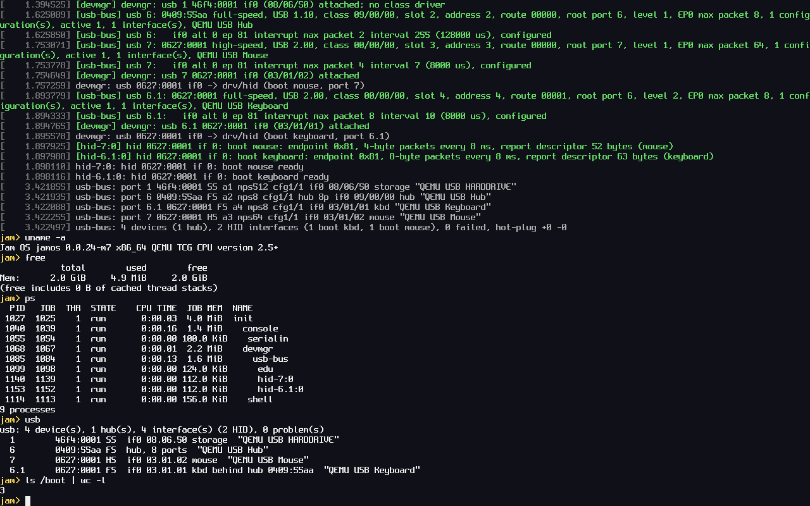

# Jam OS

Jam OS is a from-scratch operating system for x86_64 PCs, written in C. It
is capability-based: a program can do only what the handles it holds
allow, and every driver and service runs as a separate user process that
the kernel supervises through those handles. It boots from a USB stick on
a real desktop PC, which is where every milestone is tested.



## What works today

- UEFI boot from a USB stick (via Limine) on a real PC with 28 CPUs, and in
  QEMU.
- A preemptive SMP kernel: per-CPU scheduling for hybrid P/E-core CPUs,
  virtual memory, a lock-order checker, a watchdog and a panic screen with
  a symbolised backtrace.
- Capability handles, channels and ports; processes, threads and jobs with
  quotas on every kernel resource a process can use.
- Drivers as user processes: a PCI core with MSI/MSI-X and DMA
  capabilities, a device manager that restarts crashed drivers, and USB
  (xHCI controller, hubs, keyboard and mouse).
- A console and a shell with ~60 commands, pipes, variables and Tab
  completion, plus a few apps (a Mandelbrot explorer, life, tetris).
- Kernel and user-space test suites, stress tests and a benchmark, runnable
  from the boot menu or the shell.

Not yet: storage (files live in a read-only boot image), networking,
audio, power management. The plan is in [docs/ROADMAP.md](docs/ROADMAP.md).

## Build and run in QEMU

On macOS, with [Homebrew](https://brew.sh):

```sh
brew install x86_64-elf-gcc qemu mtools   # the OVMF UEFI firmware comes with qemu
make run                                  # build, then boot it in QEMU
```

`make run` boots the image in QEMU (q35, OVMF, the stick on a USB xHCI
controller, a USB keyboard) with the serial console on your terminal. Type
at the `jam>` prompt; `help` lists the commands. Python 3 is needed for
the build tools (and Pillow for test screenshots).

| Command | What it does |
|---|---|
| `make` | the kernel, the user programs and the boot filesystem image |
| `make image` | `build/jamos.img`: a FAT32 USB image with Limine (UEFI) |
| `make run` | boot the image in QEMU |
| `make debug` | the same, stopped for gdb on :1234 |
| `make check` | generated code current, the driver isolation check, the docs check |
| `make KTESTS=0` | a kernel without the in-kernel tests (into `build/noktests/`) |
| `make syscalls` | regenerate the syscall glue after editing `abi/syscalls.def` |
| `make idl` | regenerate `drivers/include/idl/` after editing `abi/idl/` |
| `make compdb` | `compile_commands.json` for editors |

Testing (the tiers, `tools/qemu-test.sh`, the shell scripts, the boot menu)
is in [docs/TESTING.md](docs/TESTING.md).

## Boot a real PC

> **Warning:** `make usb` erases the whole disk you give it. It refuses
> internal disks and asks before writing, but check the disk number twice.

Write the image with `make usb DEV=/dev/diskN`, then boot the PC from the
stick in UEFI mode with Secure Boot off. The steps, the faster way to
update a stick, and the PC it was built for are in
[docs/HARDWARE.md](docs/HARDWARE.md).

## Where things live

| Path | What |
|---|---|
| `kernel/main.c` | the boot sequence, then the tests or user space |
| `kernel/boot/` | loader glue (the only code that knows about Limine) |
| `kernel/arch/x86_64/` | entry, interrupts, syscalls, CPUs, APIC, TSC, FPU, PCIDs, IPIs |
| `kernel/acpi/` | static ACPI tables (MADT, FADT, HPET, MCFG) |
| `kernel/mm/` | physical pages, page tables, heap, address spaces |
| `kernel/sched/` | scheduler, threads, waits, mutexes |
| `kernel/object/` | kernel objects and handles |
| `kernel/abi/` | the handle-level API and the syscalls |
| `kernel/proc/` | bootfs, the ELF parser, userboot (starts init) |
| `kernel/dev/` | the kernel's own devices: framebuffer console, serial, RTC, PCI core, reboot |
| `kernel/debug/` | klog, panic, symbols, lock checker, RESULTS box, self-, crash and stress tests |
| `kernel/test/` | in-kernel tests and the benchmark |
| `kernel/include/jam/` | kernel headers |
| `drivers/` | `usb-bus/` (xHCI + hubs), `hid/` (keyboard, mouse), `test/` (test drivers), `include/` (`<jam/driver.h>`, generated IDL headers) |
| `user/lib/` | libos: startup, syscall wrappers, printf, heap, spawn, the driver API |
| `user/services/` | init, console, devmgr, serialin, shell, fat (the FAT filesystem, on FatFs) |
| `user/apps/` | fractal, life, tetris, demo, and `fun/` (the apps library) |
| `user/tests/` | utest, usbtest, contest |
| `abi/` | `syscalls.def` (the syscall table) and `idl/` (the protocols) |
| `boot/` | `limine.conf` (the boot menu), `init.cfg` (the regression run) |
| `tools/` | image, bootfs, syscall, IDL and symbol generators; checks; QEMU test scripts; the USB writer |
| `third_party/` | Limine and `limine.h`, the Spleen font, FatFs |
| `docs/` | the documentation below |

## Documentation

| Doc | For |
|---|---|
| [ARCHITECTURE.md](ARCHITECTURE.md) | how the system is designed, and why |
| [CODING-GUIDE.md](CODING-GUIDE.md) | how the code is written and changed |
| [docs/ROADMAP.md](docs/ROADMAP.md) | milestones: done, next, later |
| [docs/HISTORY.md](docs/HISTORY.md) | what each milestone delivered, bugs and lessons, decisions |
| [docs/TESTING.md](docs/TESTING.md) | test tiers and exact commands |
| [docs/HARDWARE.md](docs/HARDWARE.md) | the real PC, and flashing the stick |
| [docs/BENCH.md](docs/BENCH.md) | benchmark numbers from the PC |

## Contributing

Jam OS is one person's project, written with the help of AI. The rules for
changing the code are in [CODING-GUIDE.md](CODING-GUIDE.md).

## Licence

Jam OS is released under the [BSD 2-Clause License](LICENSE). The
third-party code in `third_party/` keeps its own licences (Limine: BSD-2-Clause; `limine.h`: 0BSD; Spleen: BSD-2-Clause; FatFs: its own one-clause BSD-style licence).
