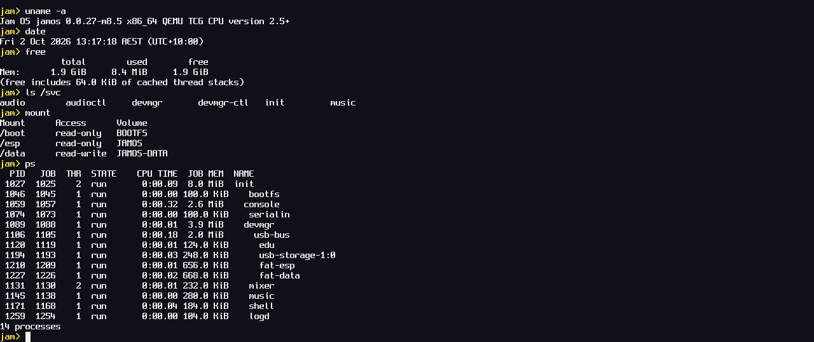

<h1 align="center">
  <picture>
    <source media="(prefers-color-scheme: dark)" srcset="docs/logo/jamos-lockup-dark.png">
    
  </picture>
</h1>

Jam OS is a from-scratch operating system for x86_64 PCs, written in C. It
is capability-based: a program can do only what the handles it holds
allow, and every driver and service runs as a separate user process that
the kernel supervises through those handles. That keeps a crashed driver
from taking the system down; with the IOMMU on (built, off by default
until the real PC signs it off) it also keeps a faulty driver's device
from writing memory its driver didn't pin. It boots from a USB stick on
a real desktop PC, which is where every milestone is tested.



## What works today

- UEFI boot from a USB stick (via Limine) on a real PC with 28 CPUs, and in
  QEMU.
- A preemptive SMP kernel: per-CPU scheduling for hybrid P/E-core CPUs,
  virtual memory, a lock-order checker, a watchdog and a panic screen with
  a symbolised backtrace.
- Capability handles, channels and ports; processes, threads and jobs with
  quotas on every kernel resource a process can use.
- Drivers as user processes: a PCI core with MSI/MSI-X and DMA
  capabilities, a device manager that restarts crashed drivers, and USB
  (xHCI controller, hubs, keyboard and mouse).
- The IOMMU (Intel VT-d, M11): with the boot entry "Jam OS (IOMMU)" (the
  boot word `iommu=on`) each driver's device reaches only the memory the
  driver pinned for it, every other DMA is blocked and logged, and a
  device can raise only its own interrupts (interrupt remapping); `iommu`
  shows the units, domains and faults. Built and tested in QEMU; off by
  default until it is signed off on the PC.
- Storage: USB sticks through a usb-storage driver and a FAT32 service
  (FatFs) per volume. The stick Jam OS boots from has its boot partition
  at `/esp`, read-only, and a data partition at `/data`; any other stick
  shows up read-only at `/usb0`, `/usb1`, ... and `mount -w` makes it
  writable. Each boot's kernel log is saved to `/data/logs/` and can be
  read on another computer.
- A console and a shell with about 80 commands, pipes, variables, Tab
  completion and file commands (`ls cat cp mv rm mkdir write df mount`),
  plus a few apps: a Mandelbrot explorer, life, tetris, snake, minesweeper
  played with the mouse, and a graphical system monitor.
- Programs in the background: `run prog args &` (or `prog &`) gives the
  prompt back at once; `jobs` lists them, `kill %2` ends one, and the next
  prompt says when one ends (`[2] done: utest (exit 0)`). Such a program
  gets no keys and no screen (Ctrl+C is the foreground program's); what
  it prints is shown as it comes. At most 8 at once; they end with the
  shell. A pipeline, a shell command or an alias can't go in the
  background yet, and the apps that draw need G1's windows for it.
- Kernel and user-space test suites, a stress test, a soak test (the
  kernel tests repeated in shuffled order under load, with sticks pulled
  and plugged) and a benchmark, runnable from the boot menu or the shell.
- Services that outlive their process: the FAT32 service and the sound
  mixer keep their state and their clients' channels outside the
  process, so when one is killed or crashes a waiting spare carries on
  where it stopped and programs see nothing: no error, no lost write, no
  gap in the sound. `storm /usb0/big.bin /data/big.bin 10` shows it:
  it copies a file while the filesystem services of both sides are
  killed ten times a second, then prints the throughput, the kills,
  kill-to-first-answer (median, p99, worst) and both files' SHA-256
  (MATCH or DIFFERENT); `storm mixer 2 60` kills the mixer while music
  plays. `tools/fatcheck.py` checks the stick's FAT32 afterwards on the
  Mac. (Built and tested in QEMU, where a 32 MiB copy at 100 kills a
  second matches; not signed off on the PC yet.)
- Sound: `beep`, and `play /data/song.wav` plays a PCM WAV
  file (8- to 32-bit, mono or stereo, any common rate) in the headphones;
  `play /data/song.mp3` plays an MP3 (CBR or VBR, ID3 tags skipped, decoded
  by dr_mp3) copied straight from the Mac; a mixer service plays several
  programs at once, `vol` sets their volumes; `music start` plays a folder
  of MP3s and WAVs in shuffle in the background while the shell goes on,
  and `jamjar` is the same player in a window: the library by artist and
  album, search, the controls with keys and the mouse, a sleep timer, and
  the albums' own covers (read from the MP3s' tags), stereo spectrum bars
  across the bottom of the screen (left up, right down) and a sunburst in
  the full-screen view.
- The real date and time: the PC's real-time clock read at boot, kept in
  UTC by the kernel and shown in the owner's time zone (Sydney, with
  daylight time; `date -z` changes it); files on the sticks and the boot
  logs are dated. Settings that survive a reboot live in
  `/data/etc/settings` (the zone, the volumes, the music folder).
- `kernel load` loads a freshly flashed kernel from the stick while Jam OS
  runs, so the next `reboot` is instant.
- A boot splash: the logo animation with its sound while Jam OS starts
  (it plays to the end, and what is typed meanwhile reaches the shell; the
  `verbose` boot entry shows the text log instead).
  After it the shell's screen holds the shell alone: the kernel log stays
  in `log` and `dmesg`, and only a few notices reach the screen (a stick
  plugged in or pulled out, a service that crashed, `/data` full).
- Each program gets only what it asks for: a list in its own file (the
  services under `/svc` and the mounts it wants, read-only or writable).
  A program copied to `/data` runs once the owner has said yes to its list
  with `allow`.
- Networking (M9, under way): Jam OS's own driver for the PC's Realtek
  RTL8125B (and for QEMU's e1000e, for the tests), a network stack in a
  process of its own (lwIP: IPv4, ARP, ICMP, UDP), every frame in one
  network mode and nothing else ever sent (plain untagged Ethernet by
  default, or tagged with a VLAN you choose); the address from DHCP or the
  settings, names from DNS, `ping` and `host`, UDP sockets for programs
  (their list asks for `svc net`, and `svc dns` for names), the boot log
  sent to the Mac as it is written, and `update` to run the Mac's newest
  build, signed with the owner's key, without moving the stick; files
  over plain HTTP both ways (`fetch` from a web server, `serve` a file in
  the background) and a throughput tester (`speed`, with
  `tools/speed.py` on the Mac) ([below](#the-network)). `version`
  names the git commit a build was made from.

Not yet: the network signed off on the PC (everything but DHCP has run
there: pings, names, the log to the Mac, `update`), the IOMMU on by
default, power management.
Status and plans: [docs/ROADMAP.md](docs/ROADMAP.md).

## Build and run in QEMU

On macOS, with [Homebrew](https://brew.sh):

```sh
brew install x86_64-elf-gcc qemu mtools   # the OVMF UEFI firmware comes with qemu
make run                                  # build, then boot it in QEMU
```

`make run` boots the image in QEMU (q35, OVMF, the stick on a USB xHCI
controller, a USB keyboard) with the serial console on your terminal. Type
at the `jam>` prompt; `help` lists the commands. Python 3 is needed for
the build tools (and Pillow for test screenshots).

| Command | What it does |
|---|---|
| `make` | the kernel, the user programs and the boot filesystem image (not the disk image) |
| `make image` | `build/jamos.img`: the USB image, a FAT32 boot partition with Limine (UEFI) and a FAT32 data partition |
| `make run` | build the image and boot it in QEMU |
| `make debug` | the same, stopped for gdb on :1234 |
| `make usb DEV=/dev/diskN` | write the image to a USB stick, erasing it ([below](#boot-a-real-pc)) |
| `make flash` | update a stick that already has Jam OS: kernel, boot image and boot menu only (the stick's kernel and boot image kept as "Jam OS (previous build)") |
| `make check` | generated code current, the driver isolation check, the docs check, the include order, the signing tool's test vectors |
| `make includes` | put `#include` lines in the order the check wants |
| `make KTESTS=0` | a kernel without the in-kernel tests (into `build/noktests/`) |
| `make syscalls` | regenerate the syscall glue after editing `abi/syscalls.def` |
| `make idl` | regenerate `drivers/include/idl/` after editing `abi/idl/` |
| `make wl` | regenerate the Wayland tables and stubs (`user/include/jwl/`, `user/lib/jwl_*.c`) from `third_party/wayland-protocols/` |
| `make compdb` | `compile_commands.json` for editors |
| `make clean` | remove `build/` |

Testing (the tiers, `tools/qemu-test.sh`, the shell scripts, the boot menu)
is in [docs/TESTING.md](docs/TESTING.md).

## Boot a real PC

> **Warning:** `make usb` erases the whole disk you give it. It refuses
> internal disks and asks before writing, but check the disk number twice.

Write the image with `make usb DEV=/dev/diskN` (find N with
`diskutil list external`), then boot the PC from the stick in UEFI mode
with Secure Boot off. After that, `make flash` updates the stick in place
and leaves `/data` alone; it asks for your password, because macOS does
not mount the stick's boot partition by itself. The details, and the PC
Jam OS is built for, are in [docs/HARDWARE.md](docs/HARDWARE.md).

## The network

Jam OS sends in one network mode only, and nothing else ever leaves
([ARCHITECTURE.md](ARCHITECTURE.md#networking)):

- **untagged** (the default of a build of this repository): plain
  Ethernet, as on an ordinary home or office network. No frame is ever
  sent with a VLAN tag, and tagged frames that arrive are dropped;
- **a VLAN** (1..4094): every frame is tagged 802.1Q with it, and only
  frames tagged with it are taken in. For a switch port that carries the
  VLAN tagged. The owner's PC uses VLAN 21
  ([docs/HARDWARE.md](docs/HARDWARE.md#the-network)).

To build for a VLAN, copy `local.mk.example` to `local.mk` (git ignores
it) and set `JAMOS_VLAN := 21` (your VLAN), or give it once:
`make JAMOS_VLAN=21`. Every `make` says which default it built
(`network default: VLAN 21 (local.mk)`, `network default: untagged (no
local.mk)`), and the boot image's `build.txt` records it (`net vlan21`,
`net untagged`). The boot word
`vlan=<id>`, `vlan=none` or `vlan=off` (the network card left off
altogether) overrides it for one boot, and a `reboot` keeps it. `update`
refuses a build whose default differs from the running one's unless given
`-f`, and `make flash` asks before it writes an untagged build. On the PC
the everyday entry "Jam OS" is on the network; "Jam OS (no network)"
(`vlan=off`) leaves the network card alone. In QEMU, `tools/qemu-test.sh` with
`QEMU_NET=1` gives the machine a card and a small network of its own
([TESTING.md](docs/TESTING.md#the-network-peer)).

| Command | What it does |
|---|---|
| `net` | the address, gateway and DNS servers, the link (speed, VLAN or untagged) and the main counts |
| `net stats` | every count netstack keeps, and the network card's own |
| `ping <address or name> [-c count] [-s size]` | ICMP echo, one a second; Ctrl+C stops it |
| `host <name>` | the name's IPv4 addresses, from the DNS server |
| `update [-n \| -w] [-f] [address]` | fetch the build the Mac serves, have init check its signature and files, and reboot into it; `-n` fetches and checks only; `-w` has init write it to the stick too; `-f` takes a build whose network default isn't this one's |
| `fetch <url> [file \| -]` | download a file over plain HTTP (`http://` only: https needs TLS, which Jam OS doesn't have yet), into the URL's last name here, a file or a folder, or a pipe |
| `serve [<file> [port] \| stop [port]]` | serve one file over HTTP in the background (port 8080 unless given); alone, what is served; `stop`, stop it |
| `speed <host> [port] [-r \| -u] [-t s]`, `speed -l [port]` | network throughput against `tools/speed.py` on the Mac, either way, TCP or UDP |

The settings, in `/data/etc/settings` on the stick (edit `etc/settings`
on the Mac, or in Jam OS), for example:

```
net.address = 10.2.21.240/24 10.2.21.1 10.2.21.1
net.host = 10.2.21.174
```

| Key | What |
|---|---|
| `net.address` | a static address: `<address>/<prefix> [<gateway> [<dns> [<dns>]]]`. Without it the DHCP client gets one |
| `net.host` | the Mac's address (10.2.21.174 for the owner's, on VLAN 21): where the log goes and where `update` fetches from |
| `netlog` | `off`: don't send the log, even with `net.host` set |
| `ntp.server` | where the clock comes from (SNTP): an IPv4 address or a name. Without it, the network's gateway, then `pool.ntp.org` if the gateway gives no time |
| `ntp` | `off`: don't set the clock from the network (it stays the real-time clock's, as `rtc` says) |

**The clock from the network.** Once the network has an address, sntp
asks the time (SNTP, UDP port 123) and sets the clock, then asks again
every hour; `date -r` says whether the clock came from the network or
from the PC's real-time clock, and the log has a line with how far off
the clock was ([ARCHITECTURE.md](ARCHITECTURE.md#time-and-settings)).

**Files and speed over the network** (TCP; the PC's address is in `net`,
10.2.21.241 on the owner's network, and the Mac's here is 10.2.21.174):

- **A file from the Mac.** In a folder on the Mac,
  `python3 -m http.server 8000` (any web server will do); on the PC,
  `cd /data` (`/boot` is read-only), then
  `fetch http://10.2.21.174:8000/<file>`. A name works as well as an
  address. fetch says the size, a progress line every 2 s, and at the end
  the bytes, the time and the speed (MB/s, 10^6 bytes a second). The file
  is written as `<file>.part` and renamed once it is whole, so a fetch
  that fails or is stopped (Ctrl+C) leaves nothing. It follows up to 3
  redirects (to `http://` only) and takes Content-Length, chunked and
  until-closed bodies; a head over 16 KiB, no whole head in 20 s or a body
  silent for 30 s ends it (exit 1). `fetch <url> | head` writes into the
  pipe (at most 4 MiB, the pipe's size). Into a file, the speed is the
  stick's writing speed.
- **A file to the Mac.** On the PC `serve /data/big.bin` (port 8080;
  `serve /data/big.bin 9000` for another, or `serve /data/big.bin 80` for
  the web's own, so `curl http://10.2.21.241/` needs no port). It serves in the
  background (bin/serve, a service init runs), so the shell is free at
  once. On the Mac:

  ```sh
  curl http://10.2.21.241:8080/ -o big.bin
  ```

  Every path gets that file and nothing else: no folder listing, nothing
  from the request is ever opened (GET and HEAD, one byte range, so
  `curl -C -` resumes; a browser works too). Up to 4 files on 4 ports and
  24 clients at once (16 a file), each cut off after 30 s without
  progress; each request is a line in the log. `serve` alone lists what is
  served (file, port, clients, requests, bytes sent); `serve stop` stops
  everything, `serve stop 9000` one. bin/serve holds the listen
  permission for every port, those below 1024 too (`svc net listen low`
  in its list: no other program has it, and no program on `/data` can
  be allowed it), and no mount: the shell opens the file and hands it
  over. When the network has no address yet, `serve` says so after 5 s.
- **Throughput.** On the Mac, from the repository:

  ```sh
  python3 tools/speed.py server
  ```

  (TCP and UDP port 5201; allow incoming connections if macOS asks). On
  the PC: `speed 10.2.21.174` (it sends for 5 s; `-t 10` for 10),
  `speed 10.2.21.174 -r` (the Mac sends), `speed 10.2.21.174 -u` (UDP
  datagrams to the Mac, the lost ones counted). The other way round: on
  the PC `speed -l`, then on the Mac
  `python3 tools/speed.py client 10.2.21.241` (it sends) and
  `python3 tools/speed.py client 10.2.21.241 -r` (the PC sends). Both
  sides say MB/s and Mbit/s. Ctrl+C stops `speed` (`speed -l` too); a port
  nothing listens on is said to be refused.

**The log on the Mac.** With `net.host` set, netlog sends each boot's
whole log, from its first line, over UDP to that address (port 5021), and
after a panic the panicked boot's log too. On the Mac, from the
repository, leave this running:

```sh
python3 tools/netlog-recv.py ~/jamos-logs
```

It listens on port 5021 (allow incoming connections if macOS asks),
prints the lines as they come, and writes one file per boot into
`~/jamos-logs`: `boot-<the boot's start, local time>.txt`, and
`boot-<...>-lastcrash.txt` for the log of a boot that panicked before
it, each with a `.pos` file beside it (how much it has, so a restarted
receiver goes on where it stopped). A receiver started late still gets
the boot from its first line. `--quiet` doesn't print the lines;
`--from <the PC's address>` takes datagrams only from it.

**A new build without moving the stick.** Updates are signed: the PC
takes only a build whose manifest was signed with your key, and a build
made without the key takes no update at all.

0. Once, on the Mac, make the key:

   ```sh
   make
   build/host/jamos-sign keygen
   ```

   That writes `~/.config/jamos/update.key` (the secret: mode 0600, never
   in the repository; back it up) and `update.pub` (its public half, which
   every later `make` builds into the boot image). It refuses to replace
   a key that is already there. Then `make` and **`make flash`**: the
   build on the stick must already have the key before `update` works, and
   the build the stick has now accepts no signed manifest at all, so this
   first signed build goes on by hand. If the key is ever lost, make a new
   one (delete the two files first) and `make flash` again: builds signed
   with the old key are refused from then on, and the other way round.
1. On the Mac: `make`, then leave this running:

   ```sh
   python3 tools/update-server.py
   ```

   It serves `build/jamos.elf`, `build/bootfs.img` and the boot menu
   `boot/limine.conf` (`--no-menu`: none) on UDP port 5022,
   each snapshot's manifest signed with `~/.config/jamos/update.key`
   (`--key <file>` for another; it won't start without one), `--build
   <dir>` for another folder, `--client <the PC's address>` to answer only
   the PC. Run `make` again whenever you like: the next `update` gets the
   new build. Let `make` finish first, or the kernel and the boot image
   can come from two builds.
2. On the PC: `update`. It fetches the build from `net.host`, init checks
   the manifest's signature against the key in the running build, then
   each file's size and SHA-256 against the manifest, the screen says
   `old -> new` (version and git commit), and the PC reboots into it. A
   build with another network default (the Mac's tree without `local.mk`,
   say) is refused: `update -f` takes it anyway.

The fetched build lives in RAM: it survives `reboot` and a panic, and a
power-off brings back the stick's. **`update -w`** keeps it: once init has
checked and loaded the build, it also writes it to the stick (only init
can: no program, the shell included, can write the boot partition), and
the stick's own build stays on as the boot menu's **"Jam OS (previous
build)"**, which `make flash` keeps the same way. The write takes a few
seconds; the stick boots throughout (the old build first, under every
name, then the new one), and if anything goes wrong the screen says how
far it got, the new build stays loaded (`reboot` runs it), and the stick
still boots the old one. `-w` needs a build with the key, as `update`
does. It brings the boot menu too: new entries in `boot/limine.conf`
reach the stick without `make flash`. init writes the menu after the
build, only if it passes init's check (its default entry boots the new
build, "Jam OS (previous build)" the previous one, every file it names is
on the stick; `make check` runs the same check on `boot/limine.conf`),
keeps the stick's old menu as `/esp/boot/limine/limine.conf.prev`, and the
stick has a whole menu at every moment; a menu that fails is left out and
the screen says why. `update` and `update -n` never touch the stick's
menu. A signature proves the build is one you signed, not that it is the
newest: an older signed build is accepted too (the versions are printed).

## Where things live

| Path | What |
|---|---|
| `kernel/main.c` | the boot sequence, then the tests or user space |
| `kernel/boot/` | loader glue: Limine's (the only code that knows about it), and a kexec'd kernel's handoff |
| `kernel/kexec/` | kexec: the reserved region, the stored kernel loaded into it, the jump after a reboot or a panic, the next boot's side (the crash record, the panicked boot's log) |
| `kernel/arch/x86_64/` | entry, interrupts, syscalls, CPUs, APIC, TSC, FPU, PCIDs, IPIs |
| `kernel/acpi/` | static ACPI tables (MADT, FADT, HPET, MCFG, DMAR) |
| `kernel/mm/` | physical pages, page tables, heap, address spaces |
| `kernel/sched/` | scheduler, threads, waits, mutexes |
| `kernel/object/` | kernel objects and handles |
| `kernel/abi/` | the handle-level API and the syscalls |
| `kernel/proc/` | bootfs, the ELF parser, userboot (starts init) |
| `kernel/dev/` | the kernel's own devices: framebuffer console, serial, RTC and the wall clock, PCI core, reboot, the IOMMU (VT-d) |
| `kernel/debug/` | klog, panic, symbols, lock checker, RESULTS box, self-, crash and stress tests |
| `kernel/test/` | in-kernel tests and the benchmark |
| `kernel/include/jam/` | kernel headers |
| `drivers/` | `usb-bus/` (xHCI + hubs), `hid/` (keyboard, mouse), `usb-storage/` (USB sticks: partitions as `block` channels), `hda/` (Intel HD Audio: codec path, one output stream, `beep`), `rtl8125/` (the PC's Realtek RTL8125B network chip), `e1000e/` (QEMU's Intel 82574L network card, for the network tests), `lib/` (code several drivers link: the netdev server, `netserver.c`), `test/` (test drivers), `include/` (`<jam/driver.h>`, `<jam/task.h>`, generated IDL headers) |
| `user/lib/` | libos: startup, syscall wrappers, printf, heap, spawn, the file namespace and `/svc`, a program's list (`<wants.h>`), the driver API, cooperative tasks (`<jam/task.h>`), sound output (`<audio.h>`), WAV headers (`<wav.h>`) and MP3 decoding (`<mp3.h>`, on dr_mp3), settings (`<settings.h>`), the calendar and time zones (`<wallclock.h>`), UTF-8, SHA-256 and IPv4 addresses as text (`<ipv4.h>`) |
| `user/services/` | init, console, devmgr, serialin, shell, bootfs (the boot image as `/boot`), fat (the FAT filesystem, on FatFs), logd (the boot log files), mixer (every program's sound into the one output), music (the background music player), netstack (the network stack, on lwIP, on the network card's rings), dhcp (the DHCP client), dns (the resolver, `/svc/dns`), netlog (the log to the Mac), sntp (the clock from the network), serve (the file server behind `serve`), update (`update`'s fetcher: the build the Mac serves, offered to init) |
| `user/apps/` | fractal, life, tetris, snake, mines, sysmon, jamjar (the music player's window), demo, splash (the boot splash), play (the shell's `play`: one file decoded and played), jamcover (jamjar's cover decoder), and `fun/` (the apps library) |
| `user/tests/` | utest, usbtest, hdatest (the HD Audio stream's checks), mixtest (the mixer's checks), mixramp (a ramp played while the mixer is killed again and again), nettest (a network driver as a hostile netstack sees it), dnstest (the resolver and the slow-peer rule), contest, ramfs (a RAM filesystem for the file tests), soakload (the soak test's user-space load), wantdebug (a list asking for `right debug`, for the allow test), wantlisten (a list asking for `svc net listen`, the same) |
| `abi/` | `syscalls.def` (the syscall table) and `idl/` (the protocols) |
| `boot/` | `limine.conf` (the boot menu), `init.cfg` (the regression run) |
| `tools/` | image, bootfs, syscall, IDL and symbol generators; checks; QEMU test scripts; the USB writer and `make flash`'s updater; `update`'s server and its signing tool (`jamos-sign`, built into `build/host/`) |
| `third_party/` | Limine and `limine.h`, the Spleen font, FatFs, dr_mp3, pl_mpeg (the splash's MPEG-1 decoder), stb_image (jamjar's album covers), stb_truetype and the Inter font (the compositor's titles), lwIP (netstack's IPv4, ARP, ICMP and UDP), Monocypher (`update`'s Ed25519 signatures) |
| `docs/` | the documentation below; `docs/logo/`, the logo |

## Documentation

| Doc | For |
|---|---|
| [ARCHITECTURE.md](ARCHITECTURE.md) | how the system is designed, and why |
| [CODING-GUIDE.md](CODING-GUIDE.md) | how the code is written and changed |
| [CONTRIBUTING.md](CONTRIBUTING.md) | issues, pull requests and what a change needs; [SECURITY.md](SECURITY.md) for reporting a security problem |
| [docs/ROADMAP.md](docs/ROADMAP.md) | milestones: done, next, later |
| [docs/M9-PLAN.md](docs/M9-PLAN.md) | the plan of the milestone under way (networking) |
| [docs/HISTORY.md](docs/HISTORY.md) | what each milestone delivered, bugs and lessons, decisions |
| [docs/TESTING.md](docs/TESTING.md) | test tiers and exact commands |
| [docs/HARDWARE.md](docs/HARDWARE.md) | the real PC, and flashing the stick |
| [docs/BENCH.md](docs/BENCH.md) | benchmark numbers from the PC |
| [docs/logo/README.md](docs/logo/README.md) | the logo's files and colours |

## Contributing

Jam OS is one person's project, written with the help of AI. The rules for
changing the code are in [CODING-GUIDE.md](CODING-GUIDE.md).

## Licence

Jam OS is released under the [BSD 2-Clause License](LICENSE). The
third-party code in `third_party/` keeps its own licences (Limine: BSD-2-Clause; `limine.h`: 0BSD; Spleen: BSD-2-Clause; FatFs: its own one-clause BSD-style licence; dr_mp3: public domain or MIT-0; pl_mpeg: MIT; stb_image and stb_truetype: MIT or public domain; Inter: SIL Open Font License 1.1; lwIP: BSD-3-Clause; Monocypher: BSD-2-Clause, or CC0).
